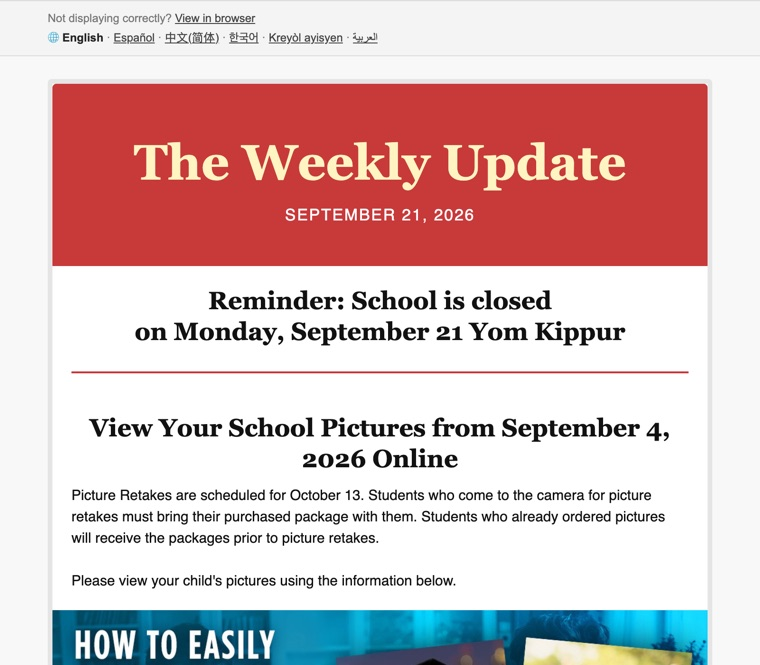
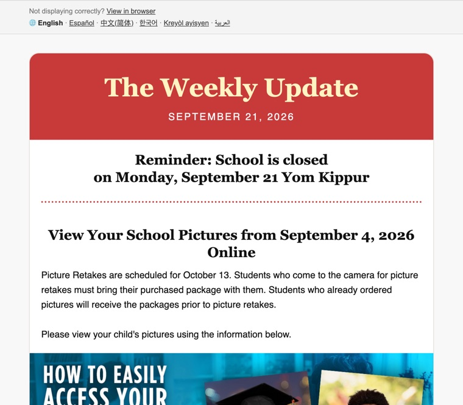
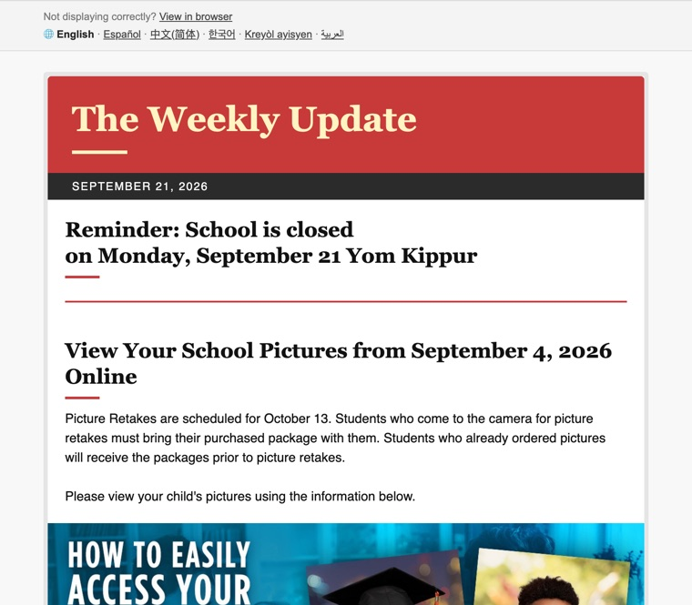
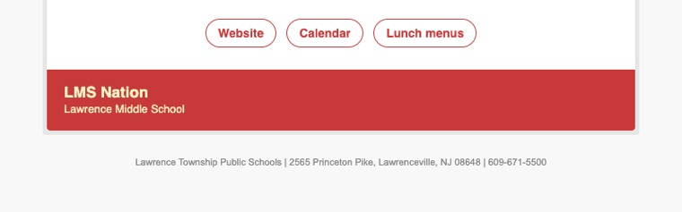

# Theming the newsletter

Change the newsletter's layout, spacing and structure without touching the renderer. This guide covers the design tokens, the block templates, extra CSS, the preview loop and the email-safety rules.

## Where each kind of change goes

| You want to change… | Where | Who |
|---|---|---|
| Sender name, subject, colours, fonts, footer text, background photo, translation languages | **Newsletter › Settings…** in the Doc (saved per folder), or brand defaults in `apps-script/Config.js` | Editors / maintainer |
| Sizes, spacing, corner radius, borders, divider style, phone breakpoint | **Tokens** in `apps-script/Theme.js` | Maintainer |
| The HTML of a block: header band, headings, dividers, images, download cards, footer, top bar | **Templates** in `apps-script/Theme.js` | Maintainer (HTML) |
| Add static rows: links, a sponsor line, a standing reminder | The **`cardTop` / `cardBottom`** templates in `Theme.js` | Maintainer (HTML) |
| Anything a template can't express | Extra **CSS** in `Theme.js` (limited in email; see [Email-safety rules](#email-safety-rules)) | Maintainer |

Don't edit `apps-script/Layout.js`. It holds the defaults, and anything in `Theme.js` is merged over them. Keeping your changes in `Theme.js` means framework updates never overwrite them.

## The loop

```zsh
npm run preview        # renders the sample issue to out/preview.html and re-renders on every save
                       # (the page refreshes itself; open it in a browser next to your editor)
npm run check-theme    # typos, wrong value types, broken templates (CI runs this too)
npm test               # full suite, including rendering with your theme
scripts/deploy-script.zsh   # push to the template Doc's script and web app
```

**In the browser instead:** edit **Theme** in the Doc's **Extensions › Apps Script** and save. **Newsletter › Preview** shows the result right away. Run **checkTheme** from the editor's function dropdown to validate; theme problems also appear as warnings in the Preview dialog. The full browser workflow, including redeploying, is in [WEB-SETUP.md](WEB-SETUP.md#5-theme-in-the-browser).

Useful variations:

```zsh
node cli/newsletter.mjs preview --watch --lang ar                          # right-to-left layout
node cli/newsletter.mjs preview --watch --doc <doc-url>                    # a real issue, real images
node cli/newsletter.mjs preview --watch --theme examples/themes/rounded.js # try a theme without editing Theme.js
```

The sample issue uses grey placeholders for images, because the image links saved in the test fixture expire. Use `--doc` to see the real images.

**When changes reach readers.** Each issue is a copy of the template Doc, with its own copy of the script. After `deploy-script.zsh`, the template and every issue started from it afterwards (**Newsletter › Start next issue**) use the new theme. Issues copied earlier keep the theme they were copied with.

## Tokens

Tokens are named values used by the default templates and the paragraph and list styling. Override only the ones you need:

```js
var NEWSLETTER_THEME = {
  tokens: {
    cardRadius: '16px',
    h1Size: 24,
    dividerStyle: 'dotted'
  }
};
```

Numbers are pixels unless noted. Values in quotes are CSS values, so any valid CSS works (`'1px solid #e2ddd5'`, `'0.1em'`). `check-theme` rejects unknown names ("Did you mean…?") and wrong types, for example a number where a string is expected.

### Card

| Token | Default | Affects |
|---|---|---|
| `width` | `700` | Maximum email width. Full-width images and the Outlook wrapper follow it |
| `pagePadding` | `'24px 10px 24px 10px'` | Space around the card |
| `cardBackground` | `'#ffffff'` | Card colour |
| `cardRadius` | `'4px'` | Card corners, including the header and footer band corners |
| `cardBorder` | `'5px solid rgba(0,0,0,0.1)'` | Card outline (removed on phones) |

### Type

| Token | Default | Affects |
|---|---|---|
| `bodySize` | `15` | Paragraphs, lists, download-card titles |
| `lineHeight` | `1.5` | Paragraphs and lists |
| `h1Size` / `h2Size` / `h3Size` | `26` / `20` / `17` | Heading 1 / 2 / 3 |
| `headingLineHeight` | `1.25` | All headings |
| `listIndent` | `'1.6em'` | Bullet and number indent (mirrored for right-to-left) |

### Spacing inside the card

CSS padding shorthand: top right bottom left.

| Token | Default | Affects |
|---|---|---|
| `h1Padding` | `'20px 20px 6px 20px'` | Around Heading 1 |
| `headingPadding` | `'14px 20px 4px 20px'` | Around Heading 2 and 3 |
| `richPadding` | `'5px 20px 20px 20px'` | Around each run of paragraphs and lists |
| `dividerPadding` | `'20px 20px 20px 20px'` | Around divider lines |
| `imagePadding` | `'10px 20px 10px 20px'` | Around smaller (not full-width) images |
| `attachmentPadding` | `'10px 20px 10px 20px'` | Around download cards |
| `tablePadding` | `'10px 20px 20px 20px'` | Around tables |
| `noticePadding` | `'14px 20px 0 20px'` | Around the machine-translation notice |

### Header band

| Token | Default | Affects |
|---|---|---|
| `bannerPadding` | `'56px 24px 44px 24px'` | Space inside the coloured header |
| `bannerTitleSize` | `52` | Newsletter name (Title style) |
| `bannerTitleLineHeight` | `1.05` | Newsletter name |
| `subtitleSize` | `17` | Date line (Subtitle style) |
| `subtitleSpacing` | `'0.08em'` | Date line letter spacing |
| `subtitleTransform` | `'uppercase'` | `uppercase`, `none`, `capitalize` |
| `subtitleColor` | `'#ffffff'` | Date line colour |

### Divider

| Token | Default | Affects |
|---|---|---|
| `dividerWidth` | `'2px'` | Line thickness |
| `dividerStyle` | `'solid'` | `solid`, `dashed`, `dotted`, `double` |

### Top bar ("View in browser" and the 🌐 language row)

| Token | Default | Affects |
|---|---|---|
| `topBarBackground` | `'#f4f4f4'` | Background |
| `topBarBorder` | `'#dddddd'` | Top and bottom rules |
| `topBarText` | `'#777777'` | Text |
| `topBarLink` | `'#444444'` | Links |

### Download cards, tables, footer, notice

| Token | Default | Affects |
|---|---|---|
| `attachmentBorder` | `'#cccccc'` | Download-card outline |
| `attachmentRadius` | `'6px'` | Download-card corners |
| `tableBorder` | `'#dddddd'` | Table cell borders |
| `tableCellPadding` | `'8px'` | Table cell padding |
| `footerPadding` | `'16px 20px'` | Inside the footer band |
| `footerNameSize` | `18` | Footer name |
| `footerTaglineSize` | `13` | Footer tagline |
| `footerLogoWidth` | `52` | Footer logo width |
| `footerNoteSize` | `11` | Small print under the card |
| `footerNoteColor` | `'#888888'` | Small print colour |
| `noticeBackground` | `'#fff8e1'` | Machine-translation notice background |
| `noticeBorder` | `'#f0d58a'` | Notice border |
| `noticeText` | `'#5c4a12'` | Notice text |

### Phones

| Token | Default | Affects |
|---|---|---|
| `mobileBreakpoint` | `630` | Screen width where the phone layout starts |
| `mobileGutter` | `'14px'` | Left and right padding on phones |
| `mobileBodySize` | `17` | Paragraph and list text on phones |
| `mobileH1Size` | `24` | Heading 1 on phones |
| `mobileBannerTitleSize` | `38` | Newsletter name on phones |

## Templates

Each block of the email comes from a named template. Override one by putting a string with the same name under `templates`. The defaults in `Layout.js` are the best starting point: copy one into `Theme.js` and edit it.

### Syntax

A small subset of [Mustache](https://mustache.github.io/):

| Write | Result |
|---|---|
| `{{name}}` | The value, HTML-escaped. Use for plain values: URLs, colours, sizes, names |
| `{{{name}}}` | The value, raw. Use only for fields documented as HTML below |
| `{{t.h1Size}}`, `{{c.accentColor}}` | Dotted paths |
| `{{#name}}…{{/name}}` | Only if `name` is truthy. Repeats for each item if it's a list |
| `{{^name}}…{{/name}}` | Only if `name` is falsy or empty |

Line breaks and the indentation after them are removed, so you can lay a template out across lines. A space you need, such as between two words, must stay on the same line.

Every template can use:

| Name | Value |
|---|---|
| `t` | All tokens (`{{t.width}}`) |
| `c` | Settings and config: `accentColor`, `accentTextColor`, `linkColor`, `textColor`, `headingFont`, `bodyFont`, `footerName`… |
| `lang` | Language of the page being rendered (`en`, `es`, `ar`…) |
| `rtl` | True for right-to-left languages |
| `start` | `left`, or `right` for right-to-left. Use it instead of hard-coding `left` |
| `pStyle` | The base paragraph style string |

### Template reference

| Template | Rendered for | Its own fields (**HTML** = use `{{{ }}}`) |
|---|---|---|
| `document` | The whole message | `title`, `preheader`, `preheaderPad` (HTML), `css` (HTML), `bgStyle`, `topBar` (HTML), `notice` (HTML), `rows` (HTML: every block below, in order), `footerNote` |
| `css` | Contents of `<style>` | Tokens and settings only. Extra CSS from the theme is appended |
| `topBar` | "View in browser" and the language row | `view` (URL), `hasLanguages`, `languages` list: `code`, `name`, `url`, `rtl`, `current`, `first` |
| `notice` | Top of translated pages | `text` (HTML), `linkText` (HTML), `originalUrl` |
| `header` | Text header from Title and Subtitle | `title` (HTML), `subtitle` (HTML) |
| `bannerImage` | Header when an image sits above the Title in the Doc | `src`, `alt` |
| `cardTop` | Right after the header. Empty by default | — |
| `heading` | Heading 1–3 | `level` (1–3), `tag` (`h2`/`h3`/`h4`), `isH1`, `size`, `padding`, `align`, `html` (HTML) |
| `rich` | Each run of paragraphs, lists and blank lines | `html` (HTML) |
| `divider` | Automatic dividers and Insert › Horizontal line | — |
| `image` | Full-width images | `src`, `alt`, `href` |
| `imageSized` | Smaller images at their Doc size | `src`, `alt`, `href`, `width`, `height`, `align` |
| `attachment` | Download cards | `href`, `kind` (`PDF`, `DOC`…), `kindSize`, `title` (HTML), `action` (HTML: "Download"/"Open"), `size` |
| `table` | Tables | `html` (HTML: the table, built in code) |
| `cardBottom` | Right before the footer. Empty by default | — |
| `footer` | Footer band | `name`, `tagline`, `logoUrl` |

Fields marked HTML are already escaped and, on translated pages, already translated. Put them in triple braces. Text you type into a template, like a "Website" link label, is shown as written on every language page. For multilingual audiences, prefer icons or labels that read in any language.

What stays in code: the inline formatting inside paragraphs, headings and list items (bold, italic, links, colours, lists) and the table cells. It follows the Doc and the translation step, and uses the tokens above (`bodySize`, `lineHeight`, `listIndent`, `tableBorder`, …) for sizing.

## Examples

All three are in `examples/themes/`. Preview any of them with `--theme`, then copy what you like into `apps-script/Theme.js`.

| Default | `rounded.js` (tokens only) | `masthead-left.js` (templates) |
|---|---|---|
|  |  |  |

### Tokens only: `rounded.js`

```js
var NEWSLETTER_THEME = {
  tokens: {
    cardRadius: '16px',
    cardBorder: '1px solid #e2ddd5',
    bannerPadding: '36px 24px 30px 24px',
    bannerTitleSize: 44,
    h1Size: 24,
    bodySize: 16,
    lineHeight: 1.6,
    dividerStyle: 'dotted',
    dividerWidth: '3px',
    attachmentRadius: '12px'
  }
};
```

### Replacing templates: `masthead-left.js`

This moves the newsletter name to the left with a short accent rule, puts the date in a dark strip under the band, and left-aligns section headings with a small accent underline. It starts from the default `header` and `heading` templates:

```js
templates: {
  header:
    '<tr><td bgcolor="{{c.accentColor}}" style="background:{{c.accentColor}};border-radius:{{t.cardRadius}} {{t.cardRadius}} 0 0;padding:28px 28px 22px 28px;text-align:left;">\n' +
    '  {{#title}}<h1 class="nl-banner-title" style="margin:0;font-family:{{c.headingFont}};font-size:40px;line-height:1.1;font-weight:bold;color:{{c.accentTextColor}};">{{{title}}}</h1>{{/title}}\n' +
    '  <div style="width:64px;height:4px;background:{{c.accentTextColor}};margin-top:14px;font-size:1px;line-height:1px;">&nbsp;</div>\n' +
    '</td></tr>\n' +
    '{{#subtitle}}<tr><td style="background:#2b2b2b;padding:8px 28px;…">{{{subtitle}}}</td></tr>{{/subtitle}}',
  heading: '…'   // see the file
}
```

Keep `class="nl-banner-title"` and `class="nl-h1"` if you want the phone-size rules from the `css` template to keep applying.

### Adding a row: `social-footer.js`



```js
var NEWSLETTER_THEME = {
  templates: {
    cardBottom:
      '<tr><td class="nl-box" align="center" style="padding:6px 20px 26px 20px;">\n' +
      '  <table role="presentation" cellspacing="0" cellpadding="0" border="0"><tr>\n' +
      '    <td class="nl-pill"><a href="https://www.example.org" style="color:{{c.accentColor}};">Website</a></td>\n' +
      '    <td class="nl-pill"><a href="https://www.example.org/calendar" style="color:{{c.accentColor}};">Calendar</a></td>\n' +
      '  </tr></table>\n' +
      '</td></tr>'
  },
  css: '.nl-pill{padding:0 6px}.nl-pill a{display:inline-block;padding:8px 14px;border:1.5px solid currentColor;border-radius:999px;…}'
};
```

### Small recipes

```js
tokens: { dividerStyle: 'double', dividerWidth: '4px' }        // heavier section breaks
tokens: { subtitleTransform: 'none', subtitleSpacing: '0' }    // "September 21, 2026" as typed
tokens: { width: 640, mobileBreakpoint: 600 }                  // narrower email
templates: { divider: '' }                                     // no divider lines at all
templates: { cardTop: '<tr><td style="padding:12px 20px;background:#fff4c2;font:bold 14px Arial,sans-serif;color:#7a1f1f;text-align:center;">Early dismissal every Wednesday at 1:10 pm</td></tr>' }
```

## Email-safety rules

Email clients are far stricter than browsers, and Outlook for Windows renders with Microsoft Word. Keep templates working everywhere:

- **Lay out with tables.** Every block is a `<tr>` inside the card's table. Use nested `<table role="presentation">` for columns, not flexbox, grid, floats or positioning.
- **Style inline.** Put visual styles in `style="…"` attributes. The `<style>` block (the `css` template and theme `css`) is for phone rules and progressive extras. Gmail supports it, but some clients drop it.
- **Give images `width` attributes** in pixels, plus `style="max-width:100%;height:auto"` for phones. Always include `alt`.
- **Use web-safe fonts**, or put the web-safe fallback last. Custom web fonts don't load in Gmail or Outlook.
- **Double the colour on bands:** `bgcolor="{{c.accentColor}}"` next to `background:{{c.accentColor}}` for Outlook.
- **Use `{{start}}`, not `left`**, for any alignment that should flip on Arabic, Farsi, Urdu or Hebrew pages. Check with `preview --lang ar`.
- **No scripts, forms or embeds.** Email clients strip them.
- **Watch the size.** Gmail clips messages over about 100 KB. `npm test` checks the sample issue stays under that.

## Checking and testing a theme

- In the Apps Script editor, run **checkTheme**: it validates the theme and test-renders the Doc, with results in the Execution log. The Preview dialog also lists theme problems.
- `npm run check-theme` validates `apps-script/Theme.js`, then renders the sample issue left-to-right and right-to-left to catch template errors. Add `--theme <file>` for another file.
- `npm test` runs the full suite: `test/layout.test.js` covers the engine and themes, and checks that the shipped theme and every example stay valid. CI runs the same in Docker on each push.
- The default output is pinned by assertions throughout the suite. If you change a default in `Layout.js` itself (a framework change), expect to update tests.

## Upgrading

When `Layout.js` changes upstream, your `Theme.js` keeps working. Tokens you didn't set pick up new defaults, and templates you didn't override pick up improvements. Templates you did override don't get upstream fixes, so after upgrading, compare your overrides with the new defaults in `Layout.js` and run `npm run check-theme`.
